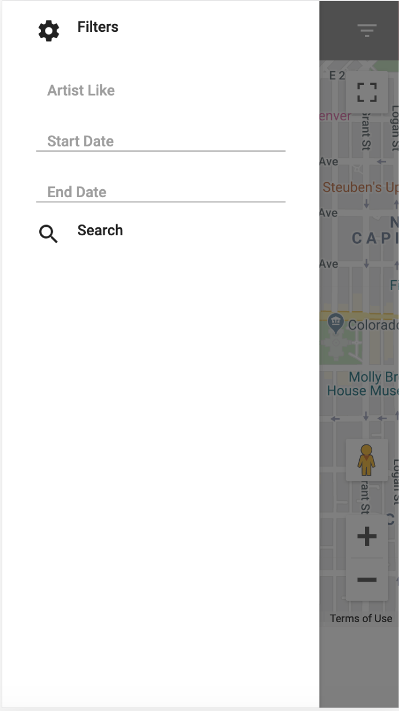

# shows-in-denver

Search for concerts in Denver, CO by artist and date.
Using JavaScript, Materialize, jQuery, moment.js Google Map API, and Seatgeek API.

# Visuals

### Browser View with Side Nav Search

### Browser View with Search Results

### Mobile View with Side Nav Search

### Mobile View with Search Results

# Usage

Use the filter icon on the top right of the navbar to enter search criteria.
Search for 'Artist Like' and a date range.
Search results are displayed in a carousel.
Search results from seatgeek contain artist, venue, date, and an image.
We have asigned a random image if seatgeek does not have an image for the artist.
Clicking on the Google style pin on the search result card will map the venue location.
The site is responsive. The side nav bar scales in size depending on the viewing size.

# Link to Project on Github

[day-planner](https://libersword.github.io/shows-in-denver/#)
